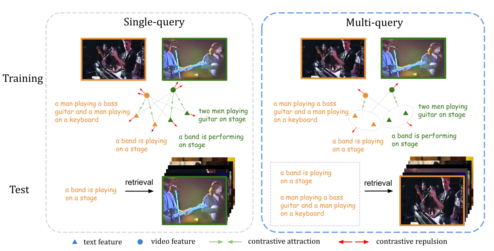

# Multi-query Video Retrieval

This repository contains the code for the paper:

**[Multi-query Video Retreival](https://arxiv.org/abs/2201.03639)**
```
@misc{wang2022multiquery,
      title={Multi-query Video Retrieval}, 
      author={Zeyu Wang and Yu Wu and Karthik Narasimhan and Olga Russakovsky},
      year={2022},
      eprint={2201.03639},
      archivePrefix={arXiv},
      primaryClass={cs.CV}
}
```



## Data Preparation

1. Download raw videos for [MSR-VTT](https://www.microsoft.com/en-us/research/publication/msr-vtt-a-large-video-description-dataset-for-bridging-video-and-language/), [MSVD](https://www.cs.utexas.edu/users/ml/clamp/videoDescription/) and [VATEX](https://eric-xw.github.io/vatex-website/download.html), and put them into `data/{dataset}/raw_videos` folder.
2. Run the script `data/extract_frames.sh` to extract frames from raw videos.

The resulting `data` folder structures like this:
```Shell
├── data
    ├── msrvtt
        ├── msrvtt_train.json
        ├── msrvtt_test.json
        ├── msrvtt_test_varying_query_sample_1-20.json
        ├── raw_videos
            ├── video0.mp4
            ├── ...
        ├── extracted_frames
            ├── video0.mp4
                ├── 0.jpg
                ├── ...
            ├── ...
    ├── msvd
        ├── ...
    ├── vatex
        ├── ...
```

For [Frozen](https://arxiv.org/abs/2104.00650) model, download the pretrained checkpoint provided by the original authors [here](https://www.robots.ox.ac.uk/~maxbain/frozen-in-time/models/cc-webvid2m-4f_stformer_b_16_224.pth.tar), and put into `record/pretrained` folder.

## Training

Run command:
`python train.py -c configs/{config_path}`

## Evaluation

Run command:
`python evaluate.py -c configs/{config_path}`

## Acknowledgements

The structure of this repository is based on https://github.com/victoresque/pytorch-template. Some of the code are adpated from https://github.com/m-bain/frozen-in-time and https://github.com/ArrowLuo/CLIP4Clip.
